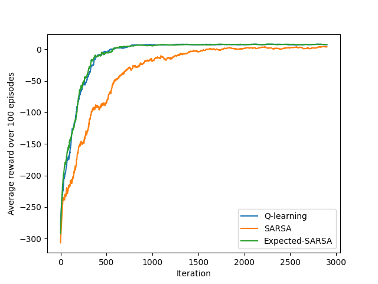

# Taxi-v3 Environment
My attempt to solve the taxi-v3 OpenAI gym environment using various algorithms
such as:

- Q-Learning
- SARSA
- Expected-SARSA
- DQNN

<br>
<div align="Center">
    
</div>

## Install

To install dependencies for this repo, run the following command:

```
pip install -r requirements.txt
```

## Description

The workspace contains the following files (in alphabetical order):

- `agent.py`: A factory for creating RL agents (follows Factory design pattern).
- `conf.yaml`: A YAML file containing the hyper-parameters for agents.
- `DQNN_Experimentation.ipynb`: An Ipython notebook containing the experiments for DQNN algorithm.
- `main.py`: The start point for this repo. In this script, you can create agents, run them and compare between their performance.
- `monitor.py`: The `interact()` function tests how well your agent learns from interaction with the environment.
- `q_learning.py`: An agent implemented using Q-Learning algorithm.
- `sarsa.py`: Three agents implemented using SARSA and Expected-SARSA respectively.
- `utils.py`: Helpful functions.


## Usage

You can use the agents found in this repository in two main ways. Before getting into that, let's first import all needed resources and define the environment:

```python
import gym
from utils import *

env = gym.make('Taxi-v3')
```

Now, let's get into the two mains things that can be done with the agents:
- Train an agent and see it interact with the environment:
    ```python
    # parse the config file where all hyper-parameters are set
    conf = load_conf("conf.yaml")

    # define the agent
    algorithms = "SARSA"
    AgentModule = AgentFactory.create_agent(algorithms)
    agent = AgentModule(env.observation_space.n, env.action_space.n, conf)
    
    # train the agent
    avg_rewards, best_avg_reward = interact(env, agent, conf)

    # see it interact with the environment.
    render(env, agent)
    ```

- Compare the performance of different agents:
    ```python
    compare(env, ["Q-learning", "SARSA", "Expected-SARSA"])
    ```

These two methods are already provided in the `main.py` file.

## Environment Benchmark

OpenAI Gym defines ["solving"](https://gym.openai.com/envs/Taxi-v3/) this task as getting average return of 9.7 over 100 consecutive trials.

The following figure shows the performance of the different algorithms in this repo:

<div align="Center">
    
</div>